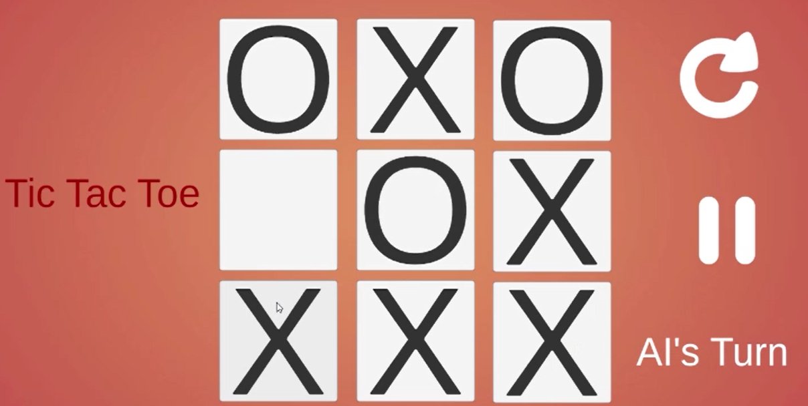
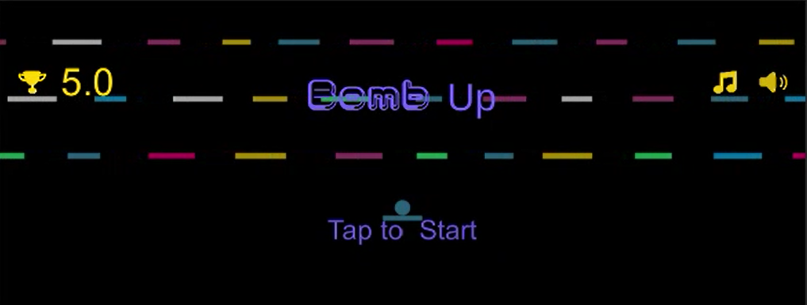

# Bomb The Enemy RTS (Real-time strategy)

---

## Programming Languages:
* 
* 

## Intro:
Welcome to Bomb The Enemy, a real-time strategy game.

The game is divided into two game modes:

### Mini Games:
In the menu, you can choose one of the mini-games to play:

1. Tic Tac Toe Player vs. Computer (AI using MinMax Algorithm)

   

2. Bomb It

   

### Main Game:
In the main game mode, you will play against dragons. Your objective is to open gates by finding matching keys (same color) to progress to the next level. You can use bombs to kill the dragons, but be careful not to destroy the boxes containing the keys. Use bows and arrows to aim and shoot at the enemies.

 

## Controls:
### Keyboard & Mouse:
- `W`, `A`, `S`, `D` or Arrow Keys - Move
- Left Mouse Click - Shoot
- Right Mouse Click - Aim (In Game)
- Space - Jump
- Shift - Run
- B - Activate Bomb
- Left Mouse Click - Take Object (like Bomb)
- Q to Release Bomb
- ESC - Open Pause Menu (In Game)

## Libraries:
- **Mirror** - Networking library for Unity. [Link](https://assetstore.unity.com/packages/tools/network/mirror-129321)
- **NavMesh** - Unity's built-in navigation mesh system for pathfinding. [Link](https://docs.unity3d.com/2023.2/Documentation/Manual/nav-BuildingNavMesh.html)
- **Profiler** - Unity's profiler for performance analysis. [Link](https://docs.unity3d.com/2021.2/Documentation/Manual/Profiler.html)

## Contact us:
- Ola's Email: [olaib@edu.hac.ac.il](mailto:olaib@edu.hac.ac.il)
- Lamaah's Email: [lamaahja@edu.hac.ac.il](mailto:lamaahja@edu.hac.ac.il)

## Credits:
- [Brackeys](https://www.youtube.com/channel/UCYbK_tjZ2OrIZFBvU6CCMiA)
- [Unity Learn](https://learn.unity.com/tutorials)
- [NavMesh](https://docs.unity3d.com/2023.2/Documentation/Manual/nav-BuildingNavMesh.html)
- [Unity Asset Store](https://assetstore.unity.com)
